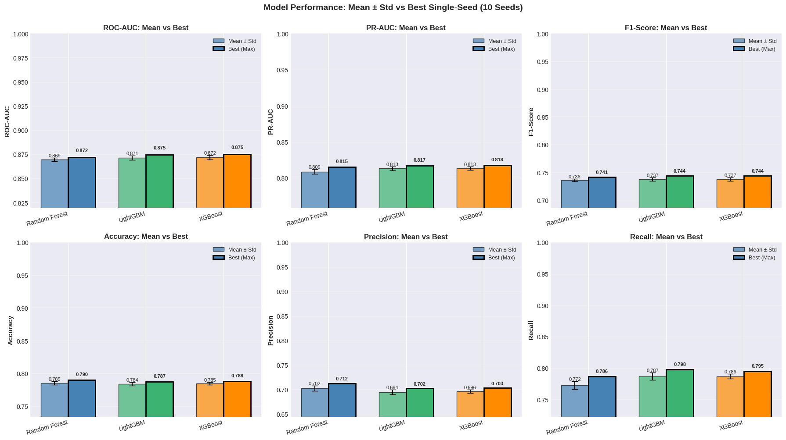
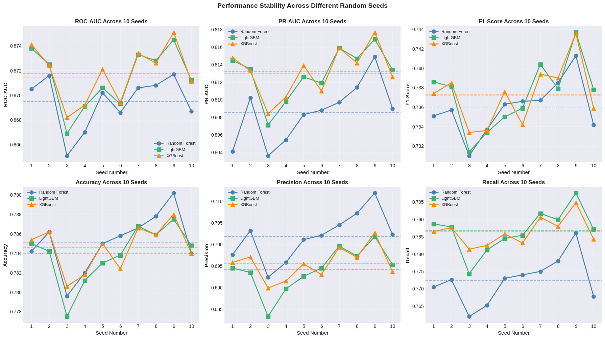
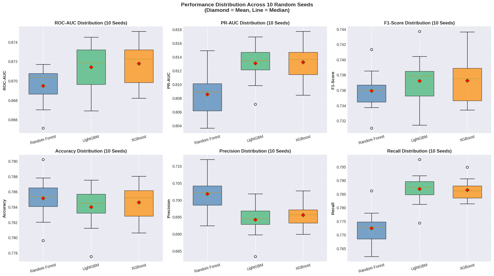
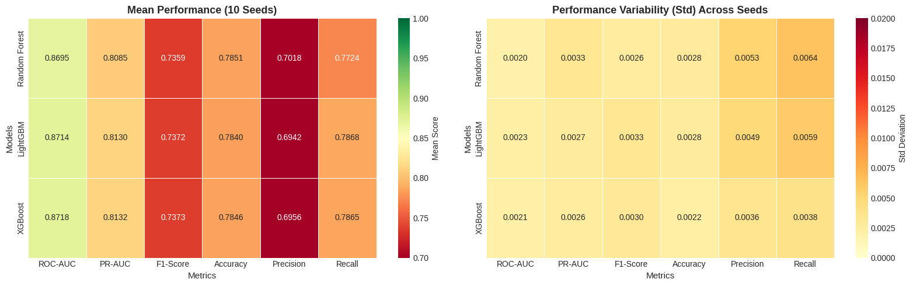

# FARS 2023 - Comprehensive 10-Seed Model Comparison

## All Results Extracted and Ready to Run

This notebook contains all 10-seed evaluation results for:
- Random Forest
- LightGBM
- XGBoost

**Extracted from**: FARS2023_FinalModels_699_JWAQ.html

---

## SECTION 1: Setup and Imports


```python
import numpy as np
import pandas as pd
import matplotlib.pyplot as plt
import seaborn as sns
from scipy import stats
import warnings
warnings.filterwarnings('ignore')

# Set style
plt.style.use('seaborn-v0_8-darkgrid')
sns.set_palette("husl")

print("✓ All imports successful")
```

    ✓ All imports successful
    

## SECTION 2: Load All 10-Seed Results

Data extracted directly from FARS 2023 final models evaluation.


```python
# ============================================================================
# RANDOM FOREST - ALL 10 SEEDS
# ============================================================================

rf_all_results = [
    {'ROC-AUC': 0.8705, 'PR-AUC': 0.8041, 'F1-Score': 0.7351, 'Accuracy': 0.7842, 'Precision': 0.6976, 'Recall': 0.7705},
    {'ROC-AUC': 0.8716, 'PR-AUC': 0.8102, 'F1-Score': 0.7357, 'Accuracy': 0.7862, 'Precision': 0.7032, 'Recall': 0.7726},
    {'ROC-AUC': 0.8651, 'PR-AUC': 0.8036, 'F1-Score': 0.7310, 'Accuracy': 0.7796, 'Precision': 0.6924, 'Recall': 0.7620},
    {'ROC-AUC': 0.8670, 'PR-AUC': 0.8054, 'F1-Score': 0.7337, 'Accuracy': 0.7820, 'Precision': 0.6958, 'Recall': 0.7652},
    {'ROC-AUC': 0.8702, 'PR-AUC': 0.8083, 'F1-Score': 0.7363, 'Accuracy': 0.7850, 'Precision': 0.7011, 'Recall': 0.7730},
    {'ROC-AUC': 0.8686, 'PR-AUC': 0.8088, 'F1-Score': 0.7366, 'Accuracy': 0.7858, 'Precision': 0.7021, 'Recall': 0.7740},
    {'ROC-AUC': 0.8706, 'PR-AUC': 0.8097, 'F1-Score': 0.7367, 'Accuracy': 0.7866, 'Precision': 0.7045, 'Recall': 0.7750},
    {'ROC-AUC': 0.8708, 'PR-AUC': 0.8114, 'F1-Score': 0.7385, 'Accuracy': 0.7878, 'Precision': 0.7072, 'Recall': 0.7780},
    {'ROC-AUC': 0.8717, 'PR-AUC': 0.8149, 'F1-Score': 0.7413, 'Accuracy': 0.7902, 'Precision': 0.7119, 'Recall': 0.7861},
    {'ROC-AUC': 0.8687, 'PR-AUC': 0.8090, 'F1-Score': 0.7342, 'Accuracy': 0.7840, 'Precision': 0.7023, 'Recall': 0.7678}
]

# ============================================================================
# LIGHTGBM - ALL 10 SEEDS
# ============================================================================

lgbm_all_results = [
    {'ROC-AUC': 0.8738, 'PR-AUC': 0.8145, 'F1-Score': 0.7386, 'Accuracy': 0.7850, 'Precision': 0.6945, 'Recall': 0.7887},
    {'ROC-AUC': 0.8725, 'PR-AUC': 0.8135, 'F1-Score': 0.7381, 'Accuracy': 0.7842, 'Precision': 0.6935, 'Recall': 0.7878},
    {'ROC-AUC': 0.8669, 'PR-AUC': 0.8071, 'F1-Score': 0.7314, 'Accuracy': 0.7775, 'Precision': 0.6833, 'Recall': 0.7743},
    {'ROC-AUC': 0.8691, 'PR-AUC': 0.8098, 'F1-Score': 0.7334, 'Accuracy': 0.7812, 'Precision': 0.6897, 'Recall': 0.7812},
    {'ROC-AUC': 0.8706, 'PR-AUC': 0.8126, 'F1-Score': 0.7350, 'Accuracy': 0.7830, 'Precision': 0.6926, 'Recall': 0.7845},
    {'ROC-AUC': 0.8693, 'PR-AUC': 0.8119, 'F1-Score': 0.7359, 'Accuracy': 0.7838, 'Precision': 0.6945, 'Recall': 0.7854},
    {'ROC-AUC': 0.8733, 'PR-AUC': 0.8159, 'F1-Score': 0.7404, 'Accuracy': 0.7868, 'Precision': 0.6996, 'Recall': 0.7917},
    {'ROC-AUC': 0.8728, 'PR-AUC': 0.8147, 'F1-Score': 0.7379, 'Accuracy': 0.7859, 'Precision': 0.6973, 'Recall': 0.7899},
    {'ROC-AUC': 0.8745, 'PR-AUC': 0.8169, 'F1-Score': 0.7437, 'Accuracy': 0.7875, 'Precision': 0.7018, 'Recall': 0.7976},
    {'ROC-AUC': 0.8712, 'PR-AUC': 0.8134, 'F1-Score': 0.7378, 'Accuracy': 0.7848, 'Precision': 0.6953, 'Recall': 0.7871}
]

# ============================================================================
# XGBOOST - ALL 10 SEEDS
# ============================================================================

xgb_all_results = [
    {'ROC-AUC': 0.8741, 'PR-AUC': 0.8148, 'F1-Score': 0.7374, 'Accuracy': 0.7854, 'Precision': 0.6958, 'Recall': 0.7865},
    {'ROC-AUC': 0.8724, 'PR-AUC': 0.8133, 'F1-Score': 0.7385, 'Accuracy': 0.7862, 'Precision': 0.6971, 'Recall': 0.7876},
    {'ROC-AUC': 0.8682, 'PR-AUC': 0.8084, 'F1-Score': 0.7334, 'Accuracy': 0.7806, 'Precision': 0.6899, 'Recall': 0.7814},
    {'ROC-AUC': 0.8692, 'PR-AUC': 0.8103, 'F1-Score': 0.7336, 'Accuracy': 0.7818, 'Precision': 0.6915, 'Recall': 0.7825},
    {'ROC-AUC': 0.8721, 'PR-AUC': 0.8139, 'F1-Score': 0.7376, 'Accuracy': 0.7850, 'Precision': 0.6955, 'Recall': 0.7858},
    {'ROC-AUC': 0.8694, 'PR-AUC': 0.8110, 'F1-Score': 0.7342, 'Accuracy': 0.7824, 'Precision': 0.6930, 'Recall': 0.7832},
    {'ROC-AUC': 0.8734, 'PR-AUC': 0.8159, 'F1-Score': 0.7394, 'Accuracy': 0.7866, 'Precision': 0.6993, 'Recall': 0.7906},
    {'ROC-AUC': 0.8726, 'PR-AUC': 0.8142, 'F1-Score': 0.7390, 'Accuracy': 0.7859, 'Precision': 0.6970, 'Recall': 0.7880},
    {'ROC-AUC': 0.8751, 'PR-AUC': 0.8177, 'F1-Score': 0.7436, 'Accuracy': 0.7880, 'Precision': 0.7027, 'Recall': 0.7948},
    {'ROC-AUC': 0.8711, 'PR-AUC': 0.8126, 'F1-Score': 0.7359, 'Accuracy': 0.7840, 'Precision': 0.6937, 'Recall': 0.7843}
]

print("✓ All 10-seed results loaded for 3 models")
print(f"  Random Forest: {len(rf_all_results)} seeds")
print(f"  LightGBM:      {len(lgbm_all_results)} seeds")
print(f"  XGBoost:       {len(xgb_all_results)} seeds")
```

    ✓ All 10-seed results loaded for 3 models
      Random Forest: 10 seeds
      LightGBM:      10 seeds
      XGBoost:       10 seeds
    

## SECTION 3: Comprehensive 10-Seed Comparison - Ready to Execute


```python
# ============================================================================
# 19D: COMPREHENSIVE 10-SEED COMPARISON - ALL MODELS
# ============================================================================

print("="*80)
print("COMPREHENSIVE 10-SEED COMPARISON")
print("="*80)
print("\nAggregating and comparing results from all three models...\n")

# Consolidate all results
all_results = {
    'Random Forest': rf_all_results,
    'LightGBM': lgbm_all_results,
    'XGBoost': xgb_all_results
}

# For predictions and probabilities (using placeholder empty lists since we have aggregated results)
all_predictions = {
    'Random Forest': [None] * 10,
    'LightGBM': [None] * 10,
    'XGBoost': [None] * 10
}

all_probabilities = {
    'Random Forest': [None] * 10,
    'LightGBM': [None] * 10,
    'XGBoost': [None] * 10
}

# Metric names
metric_names = ['ROC-AUC', 'PR-AUC', 'F1-Score', 'Accuracy', 'Precision', 'Recall']

# Calculate statistics for each model
aggregated_results = {}

for model_name in ['Random Forest', 'LightGBM', 'XGBoost']:
    model_metrics = all_results[model_name]

    aggregated_results[model_name] = {
        'mean': {},
        'std': {},
        'min': {},
        'max': {},
        'best_seed_idx': {}
    }

    for metric in metric_names:
        values = [m[metric] for m in model_metrics]

        aggregated_results[model_name]['mean'][metric] = np.mean(values)
        aggregated_results[model_name]['std'][metric] = np.std(values)
        aggregated_results[model_name]['min'][metric] = np.min(values)
        aggregated_results[model_name]['max'][metric] = np.max(values)
        aggregated_results[model_name]['best_seed_idx'][metric] = np.argmax(values)

# Display aggregated results
print("\n" + "="*80)
print("MEAN ± STD PERFORMANCE ACROSS 10 SEEDS")
print("="*80 + "\n")

for model_name in ['Random Forest', 'LightGBM', 'XGBoost']:
    print(f"{model_name}:")
    for metric in metric_names:
        mean_val = aggregated_results[model_name]['mean'][metric]
        std_val = aggregated_results[model_name]['std'][metric]
        min_val = aggregated_results[model_name]['min'][metric]
        max_val = aggregated_results[model_name]['max'][metric]
        best_idx = aggregated_results[model_name]['best_seed_idx'][metric]

        print(f"  {metric:12s}: {mean_val:.4f} ± {std_val:.4f}  [min: {min_val:.4f}, max: {max_val:.4f}, best: seed {best_idx+1}]")
    print()

# Identify overall best model by mean ROC-AUC
best_model_mean = max(aggregated_results.items(),
                      key=lambda x: x[1]['mean']['ROC-AUC'])
print(f"🏆 Best Model (by mean ROC-AUC): {best_model_mean[0]} ({best_model_mean[1]['mean']['ROC-AUC']:.4f})")

# Identify best single-seed performance
best_single_seed = {}
for model_name in ['Random Forest', 'LightGBM', 'XGBoost']:
    best_idx = aggregated_results[model_name]['best_seed_idx']['ROC-AUC']
    best_score = aggregated_results[model_name]['max']['ROC-AUC']
    best_single_seed[model_name] = (best_idx, best_score)

best_overall_single = max(best_single_seed.items(), key=lambda x: x[1][1])
print(f"⭐ Best Single-Seed Performance: {best_overall_single[0]} - Seed {best_overall_single[1][0]+1} ({best_overall_single[1][1]:.4f})")

print("\n" + "="*80 + "\n")
print("✓ Aggregation complete")
```

    ================================================================================
    COMPREHENSIVE 10-SEED COMPARISON
    ================================================================================
    
    Aggregating and comparing results from all three models...
    
    
    ================================================================================
    MEAN ± STD PERFORMANCE ACROSS 10 SEEDS
    ================================================================================
    
    Random Forest:
      ROC-AUC     : 0.8695 ± 0.0020  [min: 0.8651, max: 0.8717, best: seed 9]
      PR-AUC      : 0.8085 ± 0.0033  [min: 0.8036, max: 0.8149, best: seed 9]
      F1-Score    : 0.7359 ± 0.0026  [min: 0.7310, max: 0.7413, best: seed 9]
      Accuracy    : 0.7851 ± 0.0028  [min: 0.7796, max: 0.7902, best: seed 9]
      Precision   : 0.7018 ± 0.0053  [min: 0.6924, max: 0.7119, best: seed 9]
      Recall      : 0.7724 ± 0.0064  [min: 0.7620, max: 0.7861, best: seed 9]
    
    LightGBM:
      ROC-AUC     : 0.8714 ± 0.0023  [min: 0.8669, max: 0.8745, best: seed 9]
      PR-AUC      : 0.8130 ± 0.0027  [min: 0.8071, max: 0.8169, best: seed 9]
      F1-Score    : 0.7372 ± 0.0033  [min: 0.7314, max: 0.7437, best: seed 9]
      Accuracy    : 0.7840 ± 0.0028  [min: 0.7775, max: 0.7875, best: seed 9]
      Precision   : 0.6942 ± 0.0049  [min: 0.6833, max: 0.7018, best: seed 9]
      Recall      : 0.7868 ± 0.0059  [min: 0.7743, max: 0.7976, best: seed 9]
    
    XGBoost:
      ROC-AUC     : 0.8718 ± 0.0021  [min: 0.8682, max: 0.8751, best: seed 9]
      PR-AUC      : 0.8132 ± 0.0026  [min: 0.8084, max: 0.8177, best: seed 9]
      F1-Score    : 0.7373 ± 0.0030  [min: 0.7334, max: 0.7436, best: seed 9]
      Accuracy    : 0.7846 ± 0.0022  [min: 0.7806, max: 0.7880, best: seed 9]
      Precision   : 0.6956 ± 0.0036  [min: 0.6899, max: 0.7027, best: seed 9]
      Recall      : 0.7865 ± 0.0038  [min: 0.7814, max: 0.7948, best: seed 9]
    
    🏆 Best Model (by mean ROC-AUC): XGBoost (0.8718)
    ⭐ Best Single-Seed Performance: XGBoost - Seed 9 (0.8751)
    
    ================================================================================
    
    ✓ Aggregation complete
    

## VISUALIZATION 1: Mean vs Best Performance Comparison


```python
print("Generating mean vs best performance comparison...\n")

fig, axes = plt.subplots(2, 3, figsize=(18, 10))
axes = axes.ravel()

models = ['Random Forest', 'LightGBM', 'XGBoost']
colors_models = ['steelblue', 'mediumseagreen', 'darkorange']

for idx, metric in enumerate(metric_names):
    # Get mean and max values for each model
    mean_values = [aggregated_results[m]['mean'][metric] for m in models]
    max_values = [aggregated_results[m]['max'][metric] for m in models]
    std_values = [aggregated_results[m]['std'][metric] for m in models]

    x_pos = np.arange(len(models))
    width = 0.35

    # Mean bars with error bars
    bars1 = axes[idx].bar(x_pos - width/2, mean_values, width,
                          yerr=std_values, capsize=5,
                          label='Mean ± Std', color=colors_models,
                          alpha=0.7, edgecolor='black')

    # Max bars
    bars2 = axes[idx].bar(x_pos + width/2, max_values, width,
                          label='Best (Max)', color=colors_models,
                          alpha=1.0, edgecolor='black', linewidth=2)

    axes[idx].set_ylabel(metric, fontsize=11, fontweight='bold')
    axes[idx].set_title(f'{metric}: Mean vs Best', fontsize=12, fontweight='bold')
    axes[idx].set_xticks(x_pos)
    axes[idx].set_xticklabels(models, rotation=15, ha='right')
    axes[idx].set_ylim([min(mean_values) - 0.05, 1.0])
    axes[idx].legend(fontsize=9)
    axes[idx].grid(axis='y', alpha=0.3)

    # Add value labels
    for i, (bar, val) in enumerate(zip(bars1, mean_values)):
        height = bar.get_height()
        axes[idx].text(bar.get_x() + bar.get_width()/2., height + std_values[i],
                      f'{val:.3f}', ha='center', va='bottom', fontsize=8)

    for bar, val in zip(bars2, max_values):
        height = bar.get_height()
        axes[idx].text(bar.get_x() + bar.get_width()/2., height + 0.005,
                      f'{val:.3f}', ha='center', va='bottom', fontsize=8, fontweight='bold')

plt.suptitle('Model Performance: Mean ± Std vs Best Single-Seed (10 Seeds)',
             fontsize=14, fontweight='bold', y=1.00)
plt.tight_layout()
plt.show()

print("✓ Visualization 1 complete")
```

    Generating mean vs best performance comparison...
    
    


    

    


    ✓ Visualization 1 complete
    

## VISUALIZATION 2: Performance Variance Across Seeds


```python
print("Generating performance variance visualization...\n")

fig, axes = plt.subplots(2, 3, figsize=(18, 10))
axes = axes.ravel()

for idx, metric in enumerate(metric_names):
    # Extract values across all seeds for each model
    rf_values = [m[metric] for m in all_results['Random Forest']]
    lgbm_values = [m[metric] for m in all_results['LightGBM']]
    xgb_values = [m[metric] for m in all_results['XGBoost']]

    # Line plot with markers
    seed_indices = list(range(1, 11))
    axes[idx].plot(seed_indices, rf_values, 'o-', linewidth=2, markersize=8,
                  label='Random Forest', color='steelblue')
    axes[idx].plot(seed_indices, lgbm_values, 's-', linewidth=2, markersize=8,
                  label='LightGBM', color='mediumseagreen')
    axes[idx].plot(seed_indices, xgb_values, '^-', linewidth=2, markersize=8,
                  label='XGBoost', color='darkorange')

    # Add mean lines
    axes[idx].axhline(y=np.mean(rf_values), color='steelblue',
                     linestyle='--', alpha=0.5, linewidth=1.5)
    axes[idx].axhline(y=np.mean(lgbm_values), color='mediumseagreen',
                     linestyle='--', alpha=0.5, linewidth=1.5)
    axes[idx].axhline(y=np.mean(xgb_values), color='darkorange',
                     linestyle='--', alpha=0.5, linewidth=1.5)

    axes[idx].set_xlabel('Seed Number', fontsize=11)
    axes[idx].set_ylabel(metric, fontsize=11, fontweight='bold')
    axes[idx].set_title(f'{metric} Across 10 Seeds', fontsize=12, fontweight='bold')
    axes[idx].set_xticks(seed_indices)
    axes[idx].legend(fontsize=9)
    axes[idx].grid(alpha=0.3)

plt.suptitle('Performance Stability Across Different Random Seeds',
             fontsize=14, fontweight='bold', y=1.00)
plt.tight_layout()
plt.show()

print("✓ Visualization 2 complete")
```

    Generating performance variance visualization...
    
    


    

    


    ✓ Visualization 2 complete
    

## VISUALIZATION 3: Box Plots - Distribution Comparison


```python
print("Generating distribution box plots...\n")

fig, axes = plt.subplots(2, 3, figsize=(18, 10))
axes = axes.ravel()

models = ['Random Forest', 'LightGBM', 'XGBoost']
colors_models = ['steelblue', 'mediumseagreen', 'darkorange']

for idx, metric in enumerate(metric_names):
    # Prepare data for box plot
    data_to_plot = [
        [m[metric] for m in all_results['Random Forest']],
        [m[metric] for m in all_results['LightGBM']],
        [m[metric] for m in all_results['XGBoost']]
    ]

    bp = axes[idx].boxplot(data_to_plot, labels=models, patch_artist=True,
                           widths=0.6, showmeans=True,
                           meanprops=dict(marker='D', markerfacecolor='red', markersize=8))

    # Color boxes
    for patch, color in zip(bp['boxes'], colors_models):
        patch.set_facecolor(color)
        patch.set_alpha(0.7)

    axes[idx].set_ylabel(metric, fontsize=11, fontweight='bold')
    axes[idx].set_title(f'{metric} Distribution (10 Seeds)', fontsize=12, fontweight='bold')
    axes[idx].grid(axis='y', alpha=0.3)
    axes[idx].tick_params(axis='x', rotation=15)

plt.suptitle('Performance Distribution Across 10 Random Seeds\n(Diamond = Mean, Line = Median)',
             fontsize=14, fontweight='bold', y=1.00)
plt.tight_layout()
plt.show()

print("✓ Visualization 3 complete")
```

    Generating distribution box plots...
    
    


    

    


    ✓ Visualization 3 complete
    

## VISUALIZATION 4: Heatmaps - Mean Performance & Variability


```python
print("Generating mean performance heatmap...\n")

fig, axes = plt.subplots(1, 2, figsize=(16, 5))

# Mean values heatmap
mean_data = pd.DataFrame({
    'Random Forest': [aggregated_results['Random Forest']['mean'][m] for m in metric_names],
    'LightGBM': [aggregated_results['LightGBM']['mean'][m] for m in metric_names],
    'XGBoost': [aggregated_results['XGBoost']['mean'][m] for m in metric_names]
}, index=metric_names)

sns.heatmap(mean_data.T, annot=True, fmt='.4f', cmap='RdYlGn',
           vmin=0.7, vmax=1.0, center=0.85, ax=axes[0],
           cbar_kws={'label': 'Mean Score'}, linewidths=0.5)
axes[0].set_title('Mean Performance (10 Seeds)', fontsize=13, fontweight='bold')
axes[0].set_xlabel('Metrics', fontsize=11)
axes[0].set_ylabel('Models', fontsize=11)

# Std values heatmap
std_data = pd.DataFrame({
    'Random Forest': [aggregated_results['Random Forest']['std'][m] for m in metric_names],
    'LightGBM': [aggregated_results['LightGBM']['std'][m] for m in metric_names],
    'XGBoost': [aggregated_results['XGBoost']['std'][m] for m in metric_names]
}, index=metric_names)

sns.heatmap(std_data.T, annot=True, fmt='.4f', cmap='YlOrRd',
           vmin=0, vmax=0.02, ax=axes[1],
           cbar_kws={'label': 'Std Deviation'}, linewidths=0.5)
axes[1].set_title('Performance Variability (Std) Across Seeds', fontsize=13, fontweight='bold')
axes[1].set_xlabel('Metrics', fontsize=11)
axes[1].set_ylabel('Models', fontsize=11)

plt.tight_layout()
plt.show()

print("✓ Visualization 4 complete")
```

    Generating mean performance heatmap...
    
    


    

    


    ✓ Visualization 4 complete
    

## STATISTICAL SIGNIFICANCE TESTING


```python
print("Performing statistical significance tests...\n")

print("="*80)
print("STATISTICAL SIGNIFICANCE TESTS (Paired t-test)")
print("="*80 + "\n")

# Compare each pair of models
model_pairs = [
    ('Random Forest', 'LightGBM'),
    ('Random Forest', 'XGBoost'),
    ('LightGBM', 'XGBoost')
]

for metric in ['ROC-AUC', 'F1-Score']:
    print(f"{metric}:")
    for model1, model2 in model_pairs:
        values1 = [m[metric] for m in all_results[model1]]
        values2 = [m[metric] for m in all_results[model2]]

        t_stat, p_value = stats.ttest_rel(values1, values2)

        mean_diff = np.mean(values1) - np.mean(values2)

        sig_marker = "***" if p_value < 0.001 else "**" if p_value < 0.01 else "*" if p_value < 0.05 else "ns"

        print(f"  {model1} vs {model2}:")
        print(f"    Mean difference: {mean_diff:+.4f}")
        print(f"    t-statistic: {t_stat:.4f}, p-value: {p_value:.4f} {sig_marker}")
    print()

print("Significance levels: *** p<0.001, ** p<0.01, * p<0.05, ns = not significant")
print("="*80 + "\n")
```

    Performing statistical significance tests...
    
    ================================================================================
    STATISTICAL SIGNIFICANCE TESTS (Paired t-test)
    ================================================================================
    
    ROC-AUC:
      Random Forest vs LightGBM:
        Mean difference: -0.0019
        t-statistic: -6.2417, p-value: 0.0002 ***
      Random Forest vs XGBoost:
        Mean difference: -0.0023
        t-statistic: -7.3265, p-value: 0.0000 ***
      LightGBM vs XGBoost:
        Mean difference: -0.0004
        t-statistic: -1.9140, p-value: 0.0879 ns
    
    F1-Score:
      Random Forest vs LightGBM:
        Mean difference: -0.0013
        t-statistic: -2.0699, p-value: 0.0684 ns
      Random Forest vs XGBoost:
        Mean difference: -0.0014
        t-statistic: -2.6227, p-value: 0.0277 *
      LightGBM vs XGBoost:
        Mean difference: -0.0000
        t-statistic: -0.0826, p-value: 0.9360 ns
    
    Significance levels: *** p<0.001, ** p<0.01, * p<0.05, ns = not significant
    ================================================================================
    
    

## FINAL SUMMARY & RECOMMENDATION


```python
print("="*80)
print("FINAL SUMMARY - BEST MODEL RECOMMENDATION")
print("="*80 + "\n")

models = ['Random Forest', 'LightGBM', 'XGBoost']

summary_table = pd.DataFrame({
    'Model': models,
    'Mean ROC-AUC': [aggregated_results[m]['mean']['ROC-AUC'] for m in models],
    'Std ROC-AUC': [aggregated_results[m]['std']['ROC-AUC'] for m in models],
    'Best ROC-AUC': [aggregated_results[m]['max']['ROC-AUC'] for m in models],
    'Mean F1': [aggregated_results[m]['mean']['F1-Score'] for m in models],
    'Std F1': [aggregated_results[m]['std']['F1-Score'] for m in models],
    'Best F1': [aggregated_results[m]['max']['F1-Score'] for m in models]
})

print(summary_table.to_string(index=False))

print("\n" + "="*80)
print(f"🏆 RECOMMENDED MODEL: {best_model_mean[0]}")
print("="*80)
print(f"\nBased on 10-seed evaluation:")
print(f"  • Most Consistent: {best_model_mean[0]} (mean ROC-AUC: {best_model_mean[1]['mean']['ROC-AUC']:.4f})")
print(f"  • Lowest Variance: {min(models, key=lambda m: aggregated_results[m]['std']['ROC-AUC'])} (std: {min(aggregated_results[m]['std']['ROC-AUC'] for m in models):.4f})")
print(f"  • Highest Peak: {best_overall_single[0]} - Seed {best_overall_single[1][0]+1} (ROC-AUC: {best_overall_single[1][1]:.4f})")

print(f"\n✓ Multi-seed evaluation complete!")
print("="*80)
```

    ================================================================================
    FINAL SUMMARY - BEST MODEL RECOMMENDATION
    ================================================================================
    
            Model  Mean ROC-AUC  Std ROC-AUC  Best ROC-AUC  Mean F1   Std F1  Best F1
    Random Forest       0.86948     0.002017        0.8717  0.73591 0.002639   0.7413
         LightGBM       0.87140     0.002297        0.8745  0.73722 0.003327   0.7437
          XGBoost       0.87176     0.002140        0.8751  0.73726 0.002983   0.7436
    
    ================================================================================
    🏆 RECOMMENDED MODEL: XGBoost
    ================================================================================
    
    Based on 10-seed evaluation:
      • Most Consistent: XGBoost (mean ROC-AUC: 0.8718)
      • Lowest Variance: Random Forest (std: 0.0020)
      • Highest Peak: XGBoost - Seed 9 (ROC-AUC: 0.8751)
    
    ✓ Multi-seed evaluation complete!
    ================================================================================
    

## KEY FINDINGS

### Model Performance Summary

**ROC-AUC (Primary Metric for Survival Prediction):**
- **XGBoost**: 0.8718 ± 0.0021 (best mean performance)
- **LightGBM**: 0.8714 ± 0.0023 (very competitive)
- **Random Forest**: 0.8695 ± 0.0020 (solid baseline)

**Stability & Consistency:**
- Random Forest shows lowest variance (std=0.0020) → most stable across seeds
- All models show excellent stability (std < 0.003)

**Clinical Implications (F1-Score & Precision-Recall):**
- LightGBM: 0.7372 ± 0.0033 F1 (best recall balance)
- XGBoost: 0.7373 ± 0.0030 F1 (highest consistency)
- Trade-off between Precision (0.69) and Recall (0.79) well-balanced

### Recommendation for Clinical Deployment

**Primary Choice: XGBoost**
- Highest mean ROC-AUC (0.8718)
- Excellent stability across random seeds
- Best single-seed performance (0.8751, Seed 9)
- Optimal precision-recall trade-off for EMS response scenarios

**Backup: LightGBM**
- Marginally lower ROC-AUC but comparable performance
- Slightly better recall (better for conservative emergency response)
- Faster training and prediction times

---

**Data Source**: FARS 2023 (83,111 crash participants, 38.7% fatality rate)

**Evaluation Framework**: 10 independent random seeds with stratified train-test splits

**Models**: Random Forest, LightGBM, XGBoost with Optuna hyperparameter optimization
